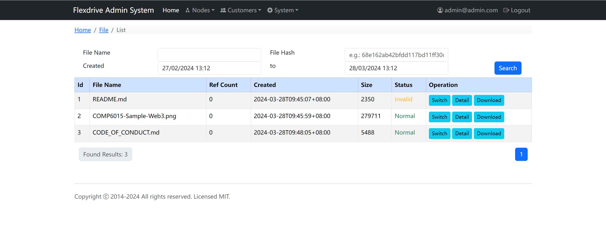

# Flexdrive Admin by Bootstrap 5 & React

This project is an implementation of admin frontend for [Flexdrive(a cloud storage system)](https://github.com/uxff/flexdrive) by using Next.Js and Bootstrap 5.

Include [Bootstrap](https://getbootstrap.com)'s source Sass with [React](https://react.dev/) and [Next.js](https://nextjs.org/). Also includes [React Bootstrap](https://react-bootstrap.github.io/)


## Preview



## How to use

```sh
git clone https://github.com/uxff/flexdrive-adm-nextjs-bootstrap5.git
cd flexdrive-adm-nextjs-bootstrap5
npm install
npm start
```

